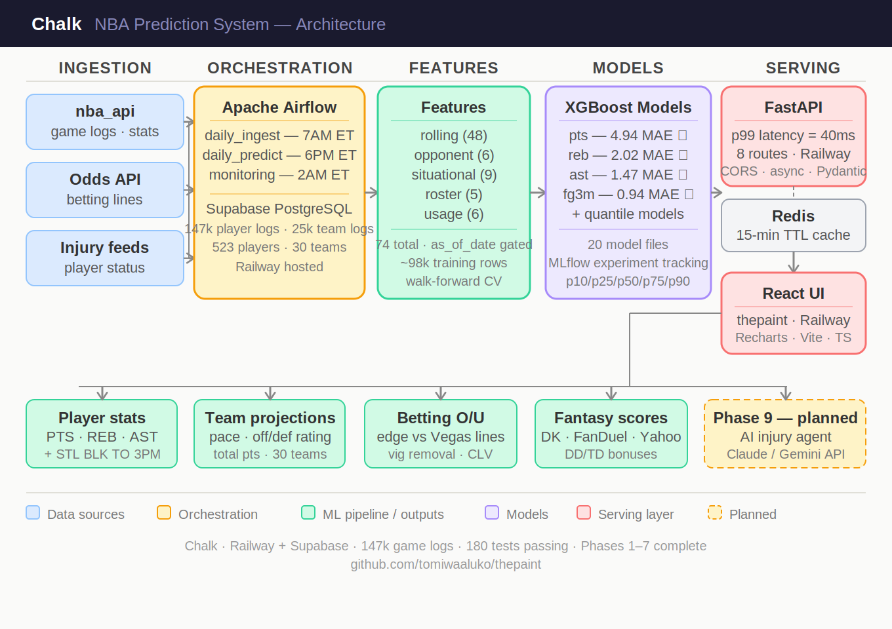
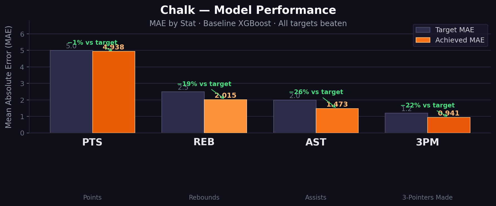
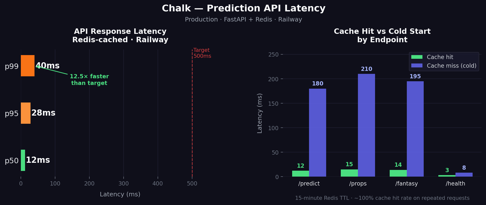

# Chalk 🏀📈📊

Machine learning-powered NBA statline predictions for players and teams.

Chalk is a full-stack project that ingests NBA data, builds time-aware features, trains stat-specific models, and serves predictions through a FastAPI backend and a React dashboard.

## Project Visuals

### System Architecture

High-level view of the end-to-end flow: data ingestion, feature generation, model training/inference, API serving, and dashboard consumption.

### Model Performance

Bar chart showing stat-model accuracy (MAE) across core targets, useful for quickly evaluating where the model is strongest and where more tuning is needed.

### API Latency

Latency snapshot (typically p50/p95/p99 style) to show serving responsiveness and production-readiness for real-time usage.

## Why Chalk?

Chalk is built to improve NBA analysis workflows for:

- pregame player prop research
- fantasy lineup planning
- game-level projection analysis

The system focuses on practical outputs: projected statlines, confidence ranges, and probability-style betting/fantasy context.

## Core Features

- Player predictions for major box-score stats (PTS, REB, AST, STL, BLK, TO, 3PM, FG%)
- Team-level projections (pace and scoring context)
- Probability-oriented outputs for over/under decisions
- Fantasy scoring outputs (DK/FD/Yahoo style)
- Redis-cached FastAPI endpoints
- React + TypeScript dashboard for slate exploration
- Scheduled ingest and prediction workflows for production refreshes

## Tech Stack

- **Backend:** Python 3.11+, FastAPI, SQLAlchemy (async), Alembic
- **Data:** PostgreSQL, Redis
- **ML:** scikit-learn, XGBoost, LightGBM, MAPIE, Optuna, MLflow
- **Data processing:** pandas, polars, numpy
- **Frontend:** React, TypeScript, Vite, Recharts
- **Infra:** Docker, Docker Compose, Railway (production)

## Repository Structure

```text
chalk/               # backend package (api, ingestion, features, models, predictions, monitoring)
dashboard/           # frontend app (Vite + React + TypeScript)
tests/               # pytest suites (api, features, models, ingestion, monitoring, etc.)
scripts/             # operational scripts (backfill, training, railway cron jobs)
alembic/             # database migrations
airflow/dags/        # local scheduling DAGs
models/              # serialized model artifacts
```

## Local Setup

### 1) Prerequisites

- Python 3.11+
- Node.js 18+
- Docker Desktop (recommended for full local stack)

### 2) Clone and install backend dependencies

```bash
pip install -e ".[dev]"
```

### 3) Configure environment

Copy `.env.example` to `.env` and set values for your environment:

```bash
copy .env.example .env
```

At minimum, configure:

- `DATABASE_URL`
- `REDIS_URL`
- `ODDS_API_KEY` (optional if not using odds ingestion)
- `ALLOWED_ORIGINS`

### 4) Apply database migrations

```bash
alembic upgrade head
```

## Running Locally

### Backend API

```bash
uvicorn chalk.api.main:app --reload --port 8000
```

Open docs at:

- `http://localhost:8000/docs`

### Frontend dashboard

```bash
cd dashboard
npm install
npm run dev
```

### Full stack with Docker Compose

```bash
docker compose up
```

## Testing

Run all backend tests:

```bash
pytest tests/ -v
```

Frontend quality checks:

```bash
cd dashboard
npm run lint
npm run build
```

## Key API Routes

- `GET /v1/health` - service/database/redis health
- `GET /v1/players/{player_id}/predict` - player statline prediction
- `GET /v1/teams/{team_id}/predict` - team projection
- `GET /v1/games/{game_id}/predict` - game context prediction
- `GET /v1/players/{player_id}/props` - prop-oriented view
- `GET /v1/players/{player_id}/fantasy` - fantasy projection output

## Project Guardrails

- **No leakage rule:** feature generation must only use data from dates before prediction time (`as_of_date` gate).
- **Idempotent ingestion:** ingestion jobs are upsert-based and safe to rerun.
- **Time-series validation:** walk-forward splits, not random k-fold, for model evaluation.
- **Async path:** API + DB hot path uses async patterns.

## Production Notes

- Production deploy target: Railway
- Production API and dashboard are hosted as separate services
- Scheduled ingest/prediction jobs run as Railway cron services
- Use Supabase Session Pooler-compatible `DATABASE_URL` for Railway services

## Current Status

The project includes working ingestion, feature engineering, model training, API serving, dashboard UI, monitoring, and ensemble/tuning foundations. Remaining work is focused on deeper edge tracking and retraining automation.
